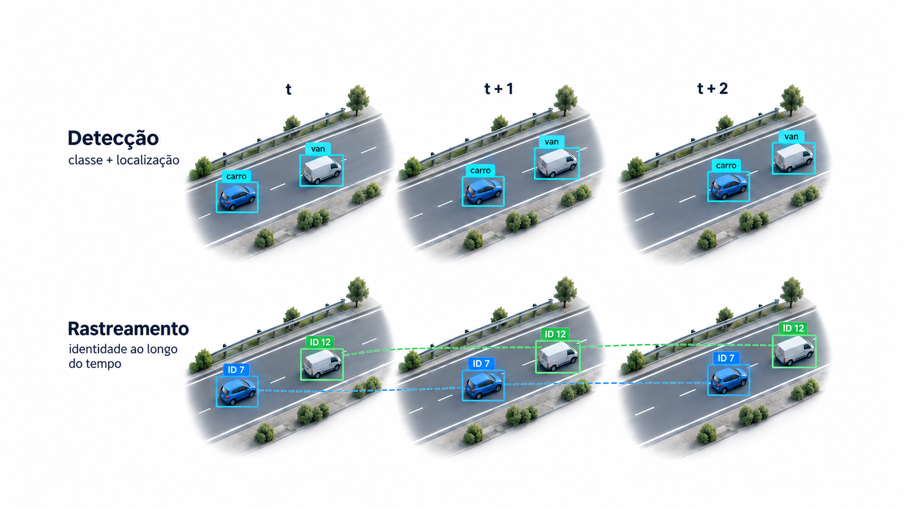
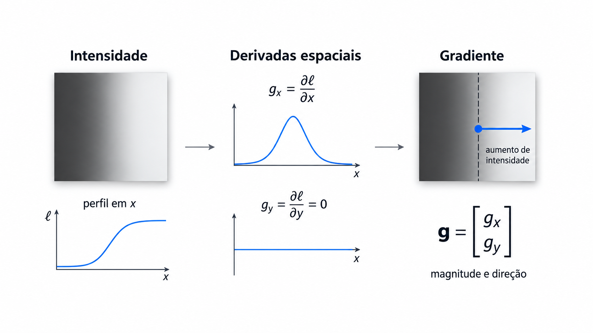
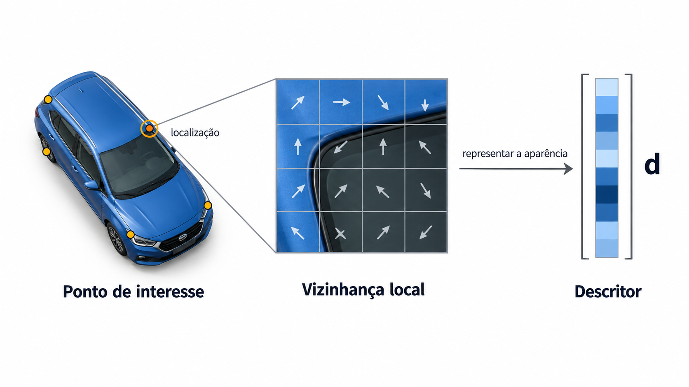
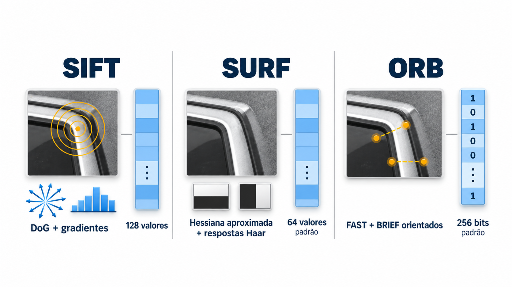
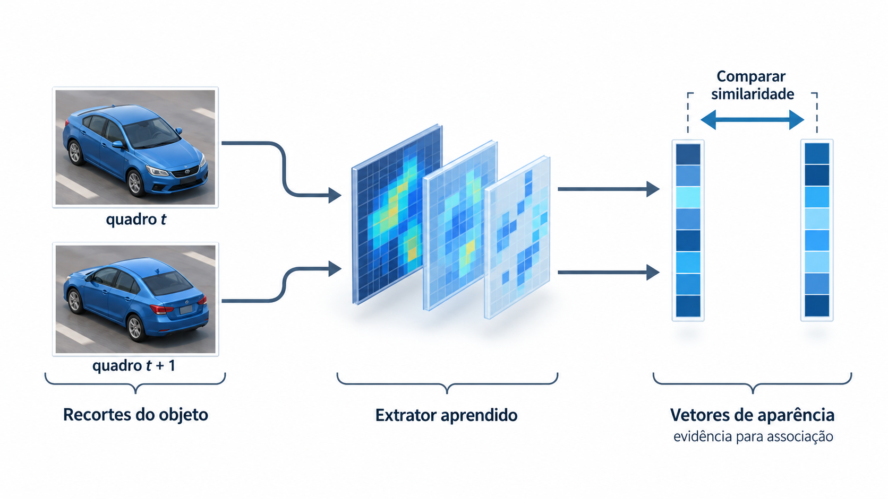
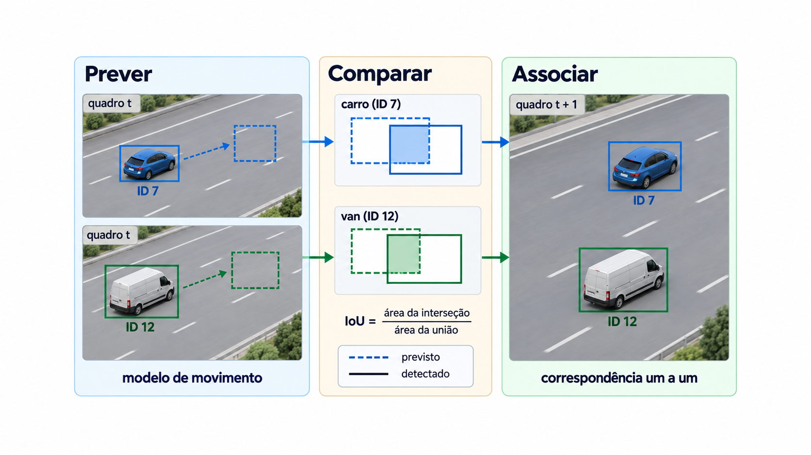
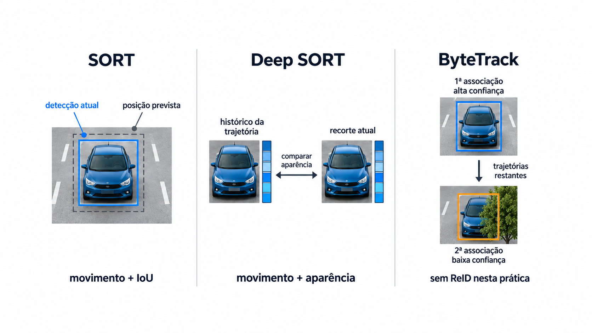
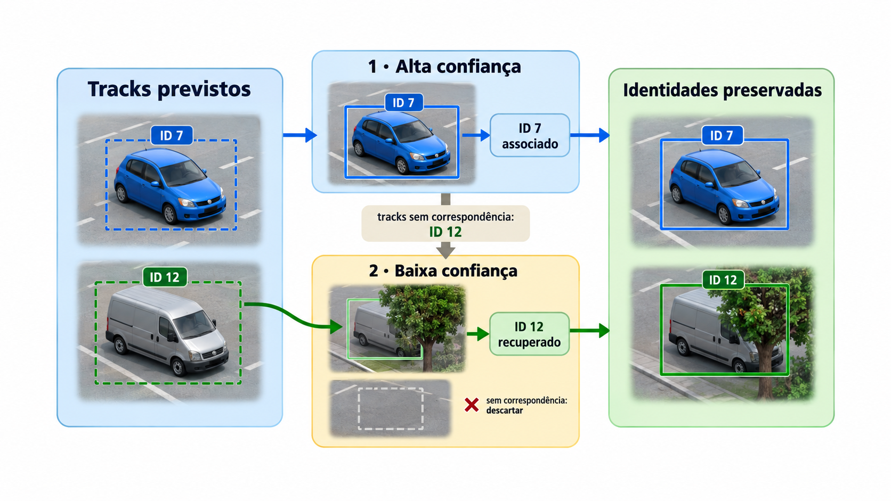
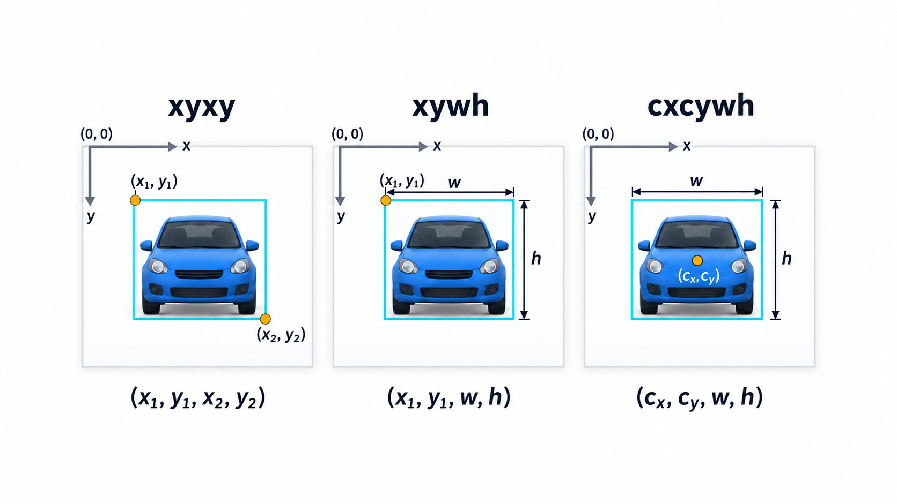
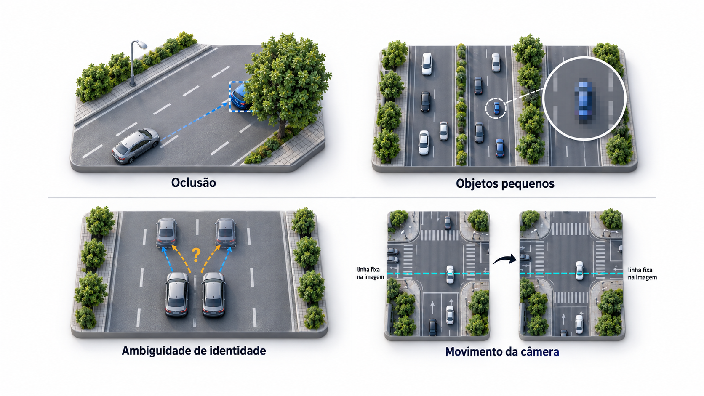

# Detecção, representação e rastreamento de objetos

O problema central é transformar uma sequência de imagens em hipóteses sobre **onde estão os objetos, a que classes pertencem e quais observações correspondem ao mesmo objeto ao longo do tempo**. Nesta aula, veículos em imagens aéreas fornecem o contexto; a formulação também se aplica a outras cenas.

Os dez infográficos seguem a ordem do [índice visual](assets/infograficos/README.md) e do [roteiro de narração](ROTEIRO_VOICE_OVER.md). As ilustrações são esquemáticas. Cores, setas, vetores e caixas explicam relações conceituais; não representam medições de um experimento. As fontes primárias e as APIs utilizadas estão reunidas em [REFERENCIAS.md](REFERENCIAS.md).

## 01. Detecção e identidade temporal

Um detector produz um conjunto de hipóteses por imagem. Cada hipótese pode incluir uma caixa delimitadora, uma classe e um escore de confiança. A classe `car` informa uma categoria; ela não distingue individualmente todos os carros da cena. A posição de uma detecção na lista também não constitui identidade.

No **rastreamento de múltiplos objetos**, ou MOT, buscamos associar observações ao longo dos quadros. Um `tracker_id` identifica uma trajetória estimada dentro da execução. Ele não é uma placa, não garante identidade global e pode ser perdido, trocado ou fragmentado.

| Elemento | Pergunta respondida | Limite |
|:--|:--|:--|
| Caixa | Onde está a hipótese de objeto? | Localização estimada no plano da imagem. |
| Classe | A que categoria ela pertence? | Objetos diferentes podem compartilhar a categoria. |
| Confiança | Qual é o escore atribuído pelo detector? | Não certifica a associação temporal nem é necessariamente uma probabilidade calibrada. |
| ID de trajetória | A qual hipótese temporal a observação foi associada? | É local ao tracker e pode conter erros. |

**Questão para discussão:** se um carro desaparecer por alguns quadros e retornar com outro ID, quantos objetos físicos e quantas trajetórias terão sido observados?

## 02. Derivadas e gradiente espacial

Considere uma função escalar de intensidade $\ell(x,y)$. Suas derivadas parciais medem a variação da intensidade nas direções espaciais. Reunimos essas componentes no vetor gradiente:

$$g_x=\frac{\partial\ell}{\partial x},\qquad g_y=\frac{\partial\ell}{\partial y},\qquad
\mathbf{g}=\nabla\ell=\begin{bmatrix}g_x\\g_y\end{bmatrix}.$$

Sua magnitude é $\lVert\mathbf{g}\rVert_2=\sqrt{g_x^2+g_y^2}$. Para gradiente não nulo, a orientação pode ser expressa por $\alpha=\operatorname{atan2}(g_y,g_x)$. Nesta aula, $x$ cresce para a direita e $y$ para baixo: ângulos positivos, medidos a partir de $+x$, giram visualmente no sentido horário. A direção de um gradiente nulo é indefinida.

O gradiente aponta para o maior aumento local da intensidade. É perpendicular às curvas regulares de intensidade constante, chamadas **isófotas**. Na transição idealizada da figura, a intensidade aumenta da esquerda para a direita: $g_x>0$ na borda e $g_y=0$. A curva de intensidade cresce mais rapidamente onde a derivada horizontal atinge seu pico. Nos gráficos, o eixo vertical representa o valor da função desenhada, e não a coordenada $y$ da imagem. [MIT Vision Book: Image Derivatives](https://visionbook.mit.edu/derivatives.html).

Imagens são amostradas: calculamos aproximações discretas das derivadas, frequentemente após suavização para reduzir a influência do ruído. Derivadas têm sinal; visualizar apenas a magnitude elimina a distinção entre aumento e diminuição da intensidade. Uma variação forte pode vir de textura, sombra ou contorno: não comprova a presença de um objeto semântico.

Esse gradiente **não é um vetor de movimento**. Também difere de $\nabla_{\boldsymbol{\theta}}J$, que deriva o custo em relação aos parâmetros no treinamento: aqui a variável é a posição espacial, e a função é a intensidade. [MIT Vision Book: Gradient Descent](https://visionbook.mit.edu/gradient_descent.html).

## 03. Pontos de interesse e descritores locais

Um **detector de pontos de interesse** seleciona posições informativas da imagem, por exemplo regiões com variações locais de intensidade. Um **descritor** transforma a vizinhança de uma posição em uma representação comparável. Localizar um ponto e descrever sua aparência são operações relacionadas, mas distintas.

A localização deve ser repetível sob as transformações relevantes; a representação deve permitir distinguir vizinhanças. Essas propriedades têm hipóteses e limites. A métrica de comparação precisa respeitar a representação: vetores numéricos e sequências de testes binários não são automaticamente comparáveis pela mesma regra.

Um carro pode conter vários pontos de interesse, e um ponto pode pertencer ao fundo. Correspondências locais também não são, isoladamente, trajetórias de objetos completos. A grade e as setas da ilustração indicam uma representação esquemática da aparência, sem especificar um descritor calculado ou sua dimensionalidade.

**Distinção adicional:** pontos semânticos de um modelo de pose, como articulações ou cantos de uma peça, têm significado definido pela tarefa. Eles não devem ser confundidos com pontos locais SIFT/ORB nem com IDs de tracking.

## 04. SIFT, SURF e ORB: características locais

Os três métodos combinam localização de pontos com descrição de sua vizinhança. São exemplos de características locais, e não uma classificação exaustiva de todos os métodos de visão computacional.

| Método | Localização e orientação | Descrição usual | Comparação usual |
|:--|:--|:--|:--|
| SIFT | Extremos de diferenças de Gaussianas (DoG) em espaço de escalas; orientação por gradientes. | Histogramas locais: $4\times4$ regiões, com 8 orientações, totalizando 128 componentes. | Distância euclidiana entre descritores normalizados. |
| SURF | Determinante aproximado da Hessiana, filtros de caixa e imagens integrais; orientação por respostas Haar. | Somas de respostas Haar: 64 componentes na versão básica; 128 na estendida. | Distância euclidiana entre descritores normalizados. |
| ORB | Pontos FAST em pirâmide e orientação estimada pelo centroide de intensidade. | Testes BRIEF orientados; 32 bytes, equivalentes a 256 bits, no padrão OpenCV. | Hamming para `WTA_K=2`. |

SIFT agrega gradientes em uma referência local de escala e orientação. SURF aproxima operações para localização e descrição com filtros eficientes. ORB compara intensidades em pares de posições: seus bytes codificam testes, e não coordenadas às quais se aplica indiscriminadamente distância euclidiana. FAST isolado não fornece a orientação usada pelo ORB. [Lowe, 2004](https://www.cs.ubc.ca/~lowe/papers/ijcv04.pdf); [Bay et al., 2006](https://people.ee.ethz.ch/~surf/eccv06.pdf); [OpenCV: ORB](https://docs.opencv.org/4.13.0/d1/d89/tutorial_py_orb.html).

Os números da figura identificam configurações específicas. Em SURF, `extended=false` seleciona 64 componentes; `true`, 128. Em ORB, a configuração ilustrada usa `WTA_K=2`; com 3 ou 4, a comparação usa `NORM_HAMMING2`. As barras são esquemáticas, sem valores calculados. Não se deve deduzir precisão, velocidade ou superioridade apenas da dimensão de um descritor. [API SURF](https://docs.opencv.org/4.13.0/d5/df7/classcv_1_1xfeatures2d_1_1SURF.html); [API ORB](https://docs.opencv.org/4.13.0/db/d95/classcv_1_1ORB.html).

**Conexão com a aula:** esses métodos ajudam a compreender a representação visual. Eles não equivalem a detectores de veículos nem mantêm, sozinhos, IDs de objetos ao longo do vídeo. ByteTrack pertence à etapa de associação temporal apresentada a seguir.

## 05. Características aprendidas e aparência

Redes neurais aprendem representações a partir dos dados. Um mapa de características preserva organização espacial e canais; um vetor de aparência pode resumir um recorte de objeto para comparação. A arquitetura e a função de treinamento determinam o que essa representação tende a preservar.

Em métodos com **reidentificação**, ou Re-ID, a aparência fornece uma evidência adicional para associar observações. Deep SORT é uma referência de integração entre informação de movimento e uma métrica de aparência aprendida. Veículos semelhantes, mudanças de iluminação e oclusões continuam podendo tornar a correspondência ambígua. [Wojke et al., 2017](https://arxiv.org/abs/1703.07402).

Um vetor não é um ID pronto. A decisão de associação depende do método, dos candidatos e de seus critérios. Da mesma forma, as características internas de um detector não são automaticamente embeddings adequados à reidentificação.

**Nesta prática:** o detector usa uma rede neural, mas o `ByteTrackTracker` escolhido recebe caixas e escores. Seu associador não extrai descritores de aparência dos pixels. A imagem explica uma alternativa conceitual, não uma etapa oculta dos nossos notebooks.

## 06. Associação geométrica e movimento

No paradigma **tracking-by-detection**, o rastreador recebe as hipóteses do detector. Um modelo de movimento prevê estados; a associação compara candidatos e atribui correspondências. A atribuição deve evitar que duas detecções atualizem simultaneamente a mesma trajetória sem uma regra explícita.

Para duas regiões $A$ e $B$, a interseção sobre união é

$$\operatorname{IoU}(A,B)=\frac{|A\cap B|}{|A\cup B|}.$$

A IoU mede sobreposição espacial, não identidade. Um veículo diferente pode ocupar uma posição semelhante após uma oclusão. O filtro de Kalman, por sua vez, estima estado e incerteza sob um modelo; ele não torna observável um objeto que desapareceu da imagem.

O exemplo visual mostra pares compatíveis, sem reproduzir uma matriz de custos completa. Na implementação usada, a atribuição é resolvida por um algoritmo de otimização; não corresponde a escolher independentemente o maior valor de cada linha. [SORT](https://arxiv.org/abs/1602.00763); [API ByteTrack](https://trackers.roboflow.com/latest/trackers/bytetrack/).

## 07. SORT, Deep SORT e ByteTrack

Os três rastreadores se inserem no paradigma de rastreamento por detecção. A comparação organiza **fontes de evidência e decisões de associação**, sem estabelecer um ranking universal.

| Método | Evidência e associação | Interpretação |
|:--|:--|:--|
| SORT | Previsão por filtro de Kalman, IoU entre caixas e atribuição húngara. | Compatibilidade de movimento e posição. |
| Deep SORT | Modelo de movimento, restrições geométricas e distância de aparência aprendida, com cascata de associação. | Acrescenta evidência visual para reduzir ambiguidades temporais. |
| ByteTrack usado na prática | Previsão de movimento e associação por IoU em duas faixas de confiança. | Aproveita caixas fracas para recuperar trajetórias sem correspondência na primeira etapa. |

Na coluna SORT, a caixa tracejada indica a posição prevista no quadro atual. Na coluna Deep SORT, os recortes são **observações** do histórico e do quadro atual; a rede descreve sua aparência, sem prever uma imagem futura do veículo. Na coluna ByteTrack, os dois níveis representam etapas de associação **no processamento do mesmo quadro**, e não dois quadros sucessivos. [SORT](https://arxiv.org/abs/1602.00763); [Deep SORT](https://arxiv.org/abs/1703.07402); [ByteTrack](https://arxiv.org/abs/2110.06864).

O rótulo “sem ReID nesta prática” descreve `trackers==2.6.1`, usado nos notebooks. A estratégia BYTE do artigo admite variantes com aparência na primeira associação; não se deve generalizar a ausência de ReID a toda implementação. Aparência semelhante, boa sobreposição ou confiança alta são evidências, não provas de identidade.

## 08. ByteTrack: recuperar evidências fracas

Uma detecção de baixa confiança pode corresponder a um objeto parcialmente ocluído. Descartar prematuramente todas essas detecções remove evidências que poderiam manter uma trajetória.

A ideia central de BYTE é associar primeiro as detecções de maior confiança e, depois, tentar recuperar trajetórias ainda sem correspondência usando detecções de menor confiança. Uma caixa fraca sem correspondência não deve iniciar uma nova trajetória nessa segunda etapa. [Zhang et al., 2022](https://arxiv.org/abs/2110.06864).

Há três decisões distintas nos notebooks: o limiar do detector, a separação entre as faixas de confiança e a condição para iniciar um novo track. Decisões distintas não exigem valores numéricos diferentes. Seus valores são parâmetros do experimento, não constantes universais. Aumentar o primeiro limiar acima da faixa fraca pode impedir que o segundo estágio receba qualquer candidato útil.

O estado do rastreador deve avançar em todos os quadros, inclusive quando não há detecções. A memória de uma trajetória ausente não implica que a biblioteca desenhe uma caixa predita naquele quadro. IDs negativos são filtrados após a atualização; o ID zero é válido.

## 09. Coordenadas e significado geométrico

No sistema raster usado por OpenCV e pelos notebooks, a origem fica no canto superior esquerdo: $x$ cresce para a direita e $y$ para baixo. Um array de imagem é indexado como `imagem[y, x]`. Essa convenção deve ser declarada antes de converter coordenadas.

Para uma caixa $\mathbf{b}=(x_1,y_1,x_2,y_2)^\top$:

$$w=x_2-x_1,\qquad h=y_2-y_1,\qquad c_x=\frac{x_1+x_2}{2},\qquad c_y=\frac{y_1+y_2}{2}.$$

`xywh` usa canto superior esquerdo e dimensões; `cxcywh` usa centro e dimensões. Trocar os nomes sem transformar os valores desloca a caixa. Para largura $W$ e altura $H$, normalizamos coordenadas horizontais por $W$ e verticais por $H$. Normalização não corrige perspectiva nem converte pixels em metros.

Se houver redimensionamento e padding, a transformação deve ser aplicada às caixas e aos elementos geométricos da mesma cena. Com fatores $s_x,s_y$ e deslocamentos $p_x,p_y$, temos $x'=s_xx+p_x$ e $y'=s_yy+p_y$. A inversão exige remover o padding antes de dividir pela escala. Adaptadores podem já fornecer caixas na resolução original; transformar novamente é um erro.

Uma **âncora** escolhe o ponto ou conjunto de pontos usado em uma regra espacial. Centro, centro inferior e cantos não respondem à mesma pergunta. No projeto final, a passagem exige observações do mesmo ID com os quatro cantos inteiramente de um lado e, posteriormente, do outro. Enquanto a caixa atravessa a linha, ela não define um lado inequívoco. Essa regra reduz eventos causados por oscilação do centro de um veículo parado sobre a linha.

A `LineZone` também exige que as âncoras estejam dentro da faixa delimitada pelas perpendiculares que passam pelos extremos do segmento. A reta, portanto, não atua como um limite infinito de contagem. Uma observação fora dessa faixa é desconsiderada para a atualização geométrica; isso não apaga automaticamente o histórico anterior da trajetória. [API LineZone](https://supervision.roboflow.com/latest/detection/tools/line_zone/).

## 10. Limitações e interpretação das saídas

Objetos pequenos fornecem poucos pixels; oclusões removem evidências; veículos semelhantes tornam associações ambíguas. O movimento da câmera altera simultaneamente muitas posições na imagem. Nenhum desses problemas é resolvido apenas pelo desenho de caixas ou pela atribuição de números.

Uma linha fixa em pixels pode deixar de representar a mesma seção da rua quando a câmera se move. Rastros na imagem também não equivalem a deslocamentos métricos no solo. Nos exemplos VisDrone complementares, observaremos detecção e tracking, sem contador e sem estimativa de velocidade.

Convém separar quatro verificações: **o código executou**, **as coordenadas são consistentes**, **as associações parecem plausíveis** e **o desempenho foi medido contra uma referência**. Uma não implica automaticamente a seguinte. Caixas bem desenhadas e totais coincidentes podem esconder erros de identidade, omissões e duplicações.

## Da teoria à implementação

Execute [01_supervision.ipynb](01_supervision.ipynb) para inspecionar representações e anotações; [02_tracking.ipynb](02_tracking.ipynb) para construir o fluxo temporal; e [03_projeto_final.ipynb](03_projeto_final.ipynb) para transformar trajetórias em eventos auditáveis.

Ao final, explique por que o número de objetos em um quadro, o número de IDs emitidos e o número de cruzamentos são grandezas distintas. Use exemplos concretos do vídeo para sustentar a resposta.
